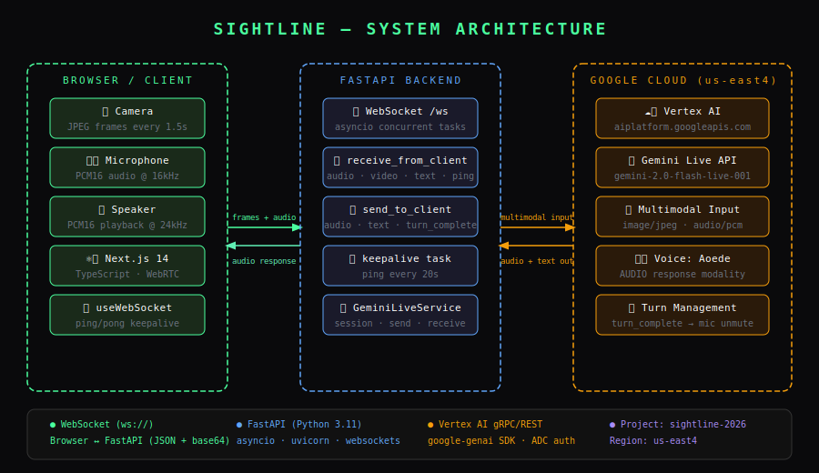

# SightLine 👁️

> **Real-time AI accessibility companion powered by Gemini Live**  
> *Gemini Live Agent Challenge 2026 — Live Agent Category*

SightLine is a voice-first accessibility app that uses your device camera and microphone to help visually impaired users understand their world in real time. Powered by Google's Gemini Live API via Vertex AI, it sees what your camera points at and describes it naturally through voice — answering follow-up questions, reading text aloud, identifying objects, and warning of hazards, all in one continuous live conversation.

---

## Architecture Diagram



**How it works:**
1. The browser streams JPEG camera frames (every 1.5s) and PCM16 mic audio (16kHz) over a WebSocket to the FastAPI backend
2. The backend forwards both to Gemini Live (`gemini-2.0-flash-live-001`) via Vertex AI using the Google GenAI SDK
3. Gemini responds with PCM16 audio (24kHz) which the backend streams back to the browser for playback
4. On `turn_complete`, the mic unmutes and the user can speak again — enabling true multi-turn conversation
5. A ping/pong keepalive task on both ends keeps the WebSocket alive during long sessions

---

## Live Deployment

**Frontend:** https://sightline-frontend-59597652459.us-east4.run.app
**Backend API:** https://sightline-backend-59597652459.us-east4.run.app/docs

---

## Proof of Google Cloud Deployment

The project uses **Vertex AI** (`aiplatform.googleapis.com`) in region `us-east4` via Application Default Credentials.

See: [`backend/app/services/gemini_service.py`](./backend/app/services/gemini_service.py)

```python
self.client = genai.Client(
    vertexai=True,
    project="sightline-2026",
    location="us-east4"
)
```

And: [`backend/app/core/config.py`](./backend/app/core/config.py)

```python
google_cloud_project: str = "sightline-2026"
google_cloud_location: str = "us-east4"
model_name: str = "gemini-2.0-flash-live-001"
```

---

## Features

- 🎙️ **Live voice conversation** — natural multi-turn dialogue with Gemini
- 📸 **Real-time camera analysis** — JPEG frames sent continuously to Gemini Live
- 🔊 **Audio responses** — Gemini speaks back using the Aoede voice
- 🔇 **Echo prevention** — mic mutes while Gemini speaks via `isSpeakingRef`, reopens on `turn_complete`
- 🔴 **Live indicator** — pulsing red dot appears when Gemini is actively speaking
- 💓 **WebSocket keepalive** — ping/pong heartbeat every 20s prevents proxy timeouts
- ♿ **Accessibility-first** — built for visually impaired users

---

## Tech Stack

| Layer | Technology |
|---|---|
| Frontend | Next.js 14, TypeScript, WebRTC |
| Backend | FastAPI, Python 3.11, asyncio |
| AI Model | `gemini-2.0-flash-live-001` |
| AI SDK | Google GenAI SDK (`google-genai`) |
| Cloud | Google Cloud Vertex AI, region `us-east4` |
| Auth | Application Default Credentials (ADC) |
| Transport | WebSocket (JSON + base64) |

---

## Getting Started (Spin-up Instructions)

### Prerequisites

- Node.js 18+
- Python 3.11+
- Google Cloud account with billing enabled
- `gcloud` CLI installed → [Install guide](https://cloud.google.com/sdk/docs/install)

### Step 1 — Clone the repo

```bash
git clone https://github.com/rkchellah/sightline.git
cd sightline
```

### Step 2 — Authenticate with Google Cloud

```bash
# Login
gcloud auth application-default login

# Set quota project (replace with your GCP project ID if different)
gcloud auth application-default set-quota-project sightline-2026

# Enable Vertex AI API
gcloud services enable aiplatform.googleapis.com --project=sightline-2026
```

### Step 3 — Backend setup

```bash
cd backend

# Create virtual environment
python -m venv .venv

# Activate — Windows PowerShell
.venv\Scripts\Activate.ps1

# Activate — Mac/Linux
source .venv/bin/activate

# Install dependencies
pip install -r requirements.txt

# Start the backend server
python -m uvicorn app.main:app --reload --port 8000
```

You should see:
```
✅ Project: sightline-2026 | Model: gemini-2.0-flash-live-001
INFO: Uvicorn running on http://0.0.0.0:8000
```

### Step 4 — Frontend setup

Open a second terminal:

```bash
cd frontend

# Install dependencies
npm install

# Start the dev server
npm run dev
```

### Step 5 — Open the app

Go to [[http://localhost:3000](http://localhost:3000)](https://sightline-frontend-59597652459.us-east4.run.app/)

Click **START** and grant camera and microphone access when prompted.

---

## Environment Variables

Create a `.env.local` file in the `frontend/` directory:

```env
NEXT_PUBLIC_WS_URL=ws://localhost:8000/ws
```

For production (Cloud Run), set:
```env
NEXT_PUBLIC_WS_URL=wss://sightline-backend-59597652459.us-east4.run.app/ws
```

---

## Project Structure

```
sightline/
├── architecture.svg              # System architecture diagram
├── README.md
│
├── backend/
│   ├── requirements.txt
│   └── app/
│       ├── main.py               # FastAPI app entry point
│       ├── api/
│       │   └── websocket.py      # WebSocket handler + keepalive task
│       ├── core/
│       │   └── config.py         # GCP project + model config
│       └── services/
│           └── gemini_service.py # Gemini Live session + turn management
│
└── frontend/
    ├── app/
    │   └── page.tsx              # Main UI + session logic
    ├── components/
    │   ├── CameraView.tsx        # Camera feed display
    │   ├── AudioVisualizer.tsx   # Audio activity indicator
    │   └── VoiceOverlay.tsx      # Gemini text overlay
    └── hooks/
        ├── useCamera.ts          # Camera + mic stream management
        ├── useWebSocket.ts       # WebSocket client + ping/pong keepalive
        └── useAudioPlayer.ts     # PCM audio queue + isSpeakingRef (mic mute logic)
```

---

## How the Multi-turn Conversation Works

The key engineering challenge was preventing Gemini from hearing its own voice echoed back through the mic (which silences it permanently).

**Solution:**
1. `useAudioPlayer.ts` exposes `isSpeakingRef` — a React ref (not state) that always holds the live speaking value
2. The `ScriptProcessorNode` checks `isSpeakingRef.current` on every audio frame — if true, the frame is dropped
3. The backend detects `turn_complete` from Gemini's response stream and sends it to the frontend
4. When `turn_complete` arrives, `isSpeakingRef.current` is set to `false` and the mic opens again

---

## Hackathon Submission

- **Challenge:** Gemini Live Agent Challenge 2026
- **Category:** Live Agent (Real-time Audio/Vision)
- **Mandatory Tech Used:** Gemini Live API, Google GenAI SDK, Vertex AI (Google Cloud)
- **GDG Profile:** https://gdg.community.dev/u/mzntqb/#/about
- **Devpost:** *(link coming)*
- **Demo Video:** *(link coming)*

---

## License

MIT


